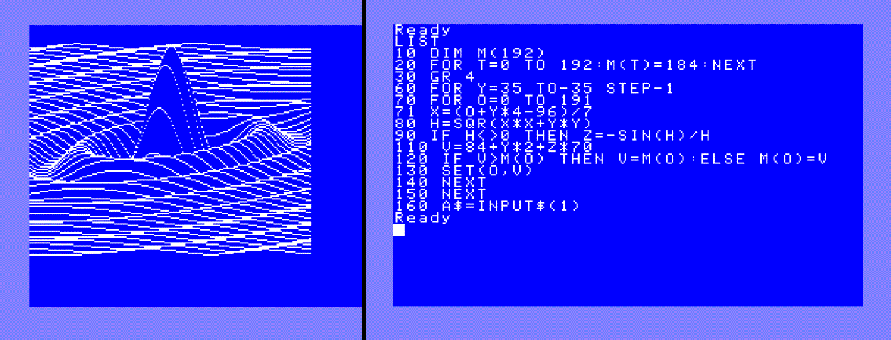

# 3D FUN

3d function plot of `SIN(R)/R` (circular sine). For Commodore16/Plus 4, C64, VIC-20 and Laser 500.

First appeared on the [Denial Forum](http://www.sleepingelephant.com/ipw-web/bulletin/bb/viewtopic.php?t=952&start=54) back in 2008.

## Commodore 16 / Commodore Plus 4

Plain [implementation](3dfun_plus4.prg) in CBM BASIC 3.5

## Commodore VIC 20

Uses the MINIGRAFIK library because the VIC 20 
does not have a native bitmap mode neither the 
commands for drawing pixels on the screen.

You can find it in the `.d64` [disk image](minigrafik.d64).

## Commodore 64

The Commodore 64 does have a hires bitmap mode, but the 
CBM BASIC V2.0 lacks the commands for drawing the pixels.
So I implemented such commands in machine language with 
ASMPROC + DASM. 

You can build [the file](3dfun_c64.prg) with the `t.bat` batch file. 

There is also a (~3x) [faster version](3dfun_c64_mospeed.prg) compiled with [Mospeed](https://github.com/EgonOlsen71/basicv2)

## VTech Laser 500

Plain [implementation](3dfun_laser500.bas) in VTECH Basic 3.0 (Microsoft Basic)

