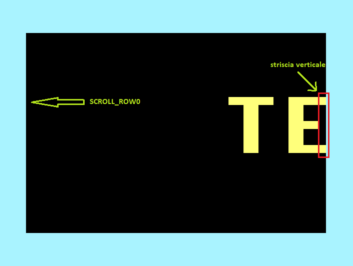
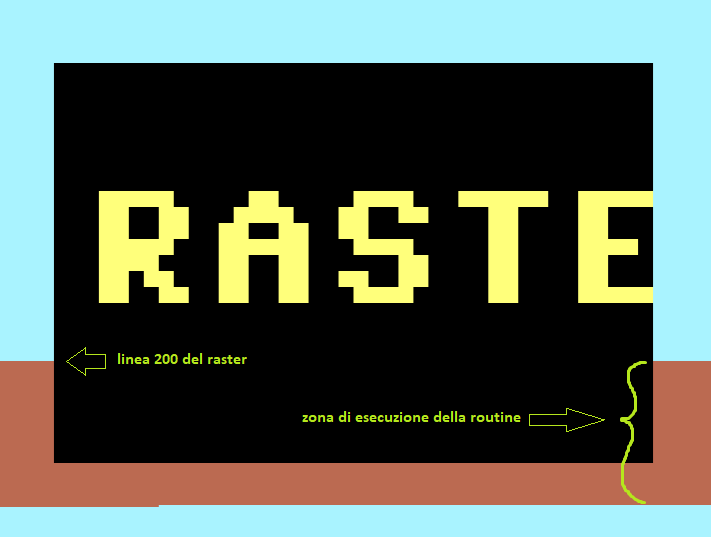

# TEXTSCROLL PER COMMODORE 64

## Obiettivo

Vogliamo realizzare una scritta "scrollante" come in questo video:
https://www.facebook.com/100010871234988/videos/764835150555519/

Qualcosa di simile l'abbiamo già trattato in un precedente articolo
https://www.facebook.com/groups/programming.c64/permalink/285785852101677/
dove scrollavamo l'intero schermo.

Qui invece ci limitiamo a scrollare solo le 8 righe che compongono
la "scritta gigante".

Oltre a scrollare, dobbiamo disegnare la scritta "in entrata"
nella parte più a destra dello schermo. 

Lo faremo disegnando solo una "striscia verticale" della scritta che verrà
fatta poi avanzare verso sinistra mediante lo scroll.

Un carattere è formato da 8 strisce verticali.

La grafica dei caratteri che compongono le strisce verticali la leggiamo 
direttamente dalla ROM del Commodore 64, la stessa ROM che il chip video 
VIC-II usa per tracciare il testo sullo schermo.

Per ogni pixel che forma un carattere disegneremo in corrispondenza 
uno "spazio in reverse". Il testo risulterà così ingrandito di 8 volte.



## Strumenti utilizzati

Utilizzeremo:

- ASMPROC (super-set del linguaggio assembly)
- DASM (assembler)

Per installare ASMPROC dal prompt dei comandi:

```
npm i -g asmproc
```

Il DASM non so da dove si possa scaricare, in caso posso fornire 
la versione da me utilizzata.

Per compilare i file di questo progetto, basta eseguire il file batch `t.bat`

## Le macro

Il sorgente `textscroll.lm` fa uso massicio delle macro definite nei 
files `macros_16.lm` e `macros.lm`. Il primo aggiunge delle pseudo
istruzioni a 16 bit (come `add16`, `inc16` ecc..); il secondo aggiunge 
delle scorciatoie come `ld mem, val`. Dovrebbe essere tutto autoesplicativo 
per cui non mi soffermerò.

Il file `c64.lm` definisce delle costanti specifiche del Commodore 64 (dimensioni
dello schermo ecc..).

## Schema del loop principale

Il loop principale ripeterà all'infinito le seguenti operazioni:

- scroll a sinistra di una posizione dell'area interessata
- disegno a destra di una striscia verticale di testo
- avanzare alla prossima striscia
- dopo 8 strisce, avanzare alla lettera successiva
- alla fine della stringa di tetso ripartire dall'inizio

## Scriviamo il codice

Apriamo un editor di testo ed iniziamo a scrivere il codice assembly con sintassi evoluta ASMPROC.

Partiamo col definire il buffer che contiene la stringa della scritta da visualizzare:

```
testo  DS 255  ; buffer di memoria (255 caratteri) dove risiede la stringa da visualizzare
```

`DS` in sta per "define space" ossia riserva spazio, 255 bytes in questo caso.

`testo` conterrà dunque la stringa da visualizzare. La fine della stringa la
identificheremo con uno zero (carattere `@` in PETSCII).

Per scrivere dentro il buffer `testo` possiamo comodamente usare il BASIC.

L'unico problema è che il BASIC usa l'ASCII mentre la ROM dei caratteri segue l'ordine PETSCII.

Convertiamo da ASCII in PETSCII nel peggior modo possibile: con `PRINT` scriviamo il carattere nella prima cella in alto a destra sullo schermo (linea 30), e poi lo leggiamo con `PEEK` dalla memoria video (linea 40).

Il carattere letto con `PEEK` sarà automaticamente convertito in PETSCII. Poi con `POKE` lo scriviamo nel buffer `testo` (linea 40). 

Lascio al lettore trovare un modo più elegante di fare la conversione da ASCII in PETSCII (scrivetelo nei commenti su FB).

```
BASIC START compact  
   10 input "{white}testo";a$
   15 a$ = a$ + "     @"
   20 for t=1 to len(a$)
   30    print "{home}";mid$(a$,t,1)
   40    poke {testo}+t-1, peek({VIDEO_RAM})
   50 next
   60 print "{yellow}{clr}"
   70 poke 53280,0:poke 53281,0   
   80 sys {main}   
BASIC END
```

Al testo inserito da tastiera aggiungiamo degli spazi di separazione ed il terminatore `@` (linea 15).

`BASIC START` e `BASIC END` sono i comandi di ASMPROC che delimitano il sorgente Basic, separandolo dal codice assembly vero e proprio. All'interno del sorgente BASIC è possibile riferirsi alle variabili usate nell'assembly, come `{testo}`, `{VIDEO_RAM}` e `{main}` alle linee 40 e 80.

La costante `VIDEO_RAM` è definita nel file `c64.lm` e vale 1024 ossia l'inizio dello schermo del C64, mentre `testo` è il buffer che abbiamo definito sopra.

Le ultime righe preparano lo schermo (linee 60,70) e richiamano la routine in assembly (linea 80).

Definiamo ora le altre variabili che useremo nella routine:

```
testo_idx   byte 0    ; indice del carattere all'interno della stringa
line        byte 0    ; (0-7) linea durante la stampa del carattere
bit_counter byte 0    ; (0-7) conta quale colonna di pixel (bit) del carattere si sta stampando
```

`testo_idx` indica la posizione all'interno della stringa `testo` del carattere che si sta 
stampando. Verrà via via incrementato fino a trovare la fine della stringa, per poi ricominciare.

Ad esempio:
```
testo = "CIAO@"
          ^   
testo_idx = 1
```

`line` è la riga durante la stampa della striscia verticale del carattere (da 0 a 7: 8 righe in totale)

`bit_counter` indica la colonna del carattere per stampare la "striscia" verticale (da 0 a 7: 8 strisce verticali in totale)

## Il loop principale

Scriviamo lo scheletro del loop principale (richiamato con `SYS` dal Basic alla linea 80) ed aggiungiamo via via pezzi di codice:

```
SUB main()

   ; inizializza   
   ld testo_idx, #0        ; parte dal primo carattere nella stringa
   ld bit_counter, #0      ; parte dal bit più a sinistra

ripeti:
   jsr scrolla_scritta             ; scrolla la scritta gigante a sinistra
   jsr calcola_address_carattere   ; calcola indirizzo nella ROM del carattere
   jsr disegna_striscia_verticale  ; disegna la striscia verticale a destra
   jsr avanza                      ; avanza alla prossima striscia e/o carattere

   jmp ripeti

END SUB
```

`SUB` e `END SUB` delimitano una subroutine, mentre `ld` non è altro che una comoda macro (`LDA`+`STA`).
Le soubroutine chiamate con `jsr` sono le soubroutine che dobbiamo ancora scrivere.

## Scroll della scritta

Per fare lo scroll, prima di tutto definiamo le costanti che ci servono:

```
; altezza della scritta gigante: 8 righe
const TEXT_HEIGHT = 8

; riga di inizio della scritta gigante
const SCROLL_START_ROW = [SCREEN_ROWS - TEXT_HEIGHT]/2
```

Per come è stata definita `SCROLL_START_ROW`, la scritta risulterà centrata nello schermo.

La costante `SCREEN_ROWS` è definita nel file "c64.lm" e vale 25. E' bene sempre usare dei
nomi esplicativi al posto delle costanti (in gergo si dice di evitare i "magic numbers"). Inoltre
è mia consuetudine mettere i nomi delle costanti in MAIUSCOLO.

Dopo aver definito `SCROLL_START_ROW`, partendo da questa definiamo in maniera esplicita 
tutte le 8 righe della zona da scrollare, mediante dei semplici calcoli di geometria:

```
; l'indirizzo video delle 8 righe della scritta gigante
const SCROLL_ROW0 = VIDEO_RAM + [[SCROLL_START_ROW+$0] * SCREEN_COLS]
const SCROLL_ROW1 = VIDEO_RAM + [[SCROLL_START_ROW+$1] * SCREEN_COLS]
const SCROLL_ROW2 = VIDEO_RAM + [[SCROLL_START_ROW+$2] * SCREEN_COLS]
const SCROLL_ROW3 = VIDEO_RAM + [[SCROLL_START_ROW+$3] * SCREEN_COLS]
const SCROLL_ROW4 = VIDEO_RAM + [[SCROLL_START_ROW+$4] * SCREEN_COLS]
const SCROLL_ROW5 = VIDEO_RAM + [[SCROLL_START_ROW+$5] * SCREEN_COLS]
const SCROLL_ROW6 = VIDEO_RAM + [[SCROLL_START_ROW+$6] * SCREEN_COLS]
const SCROLL_ROW7 = VIDEO_RAM + [[SCROLL_START_ROW+$7] * SCREEN_COLS]
```

le varie `SCROLL_ROW` puntano direttamente alla memoria video dello schermo.

Adesso lo scroll diventa molto semplice:

```
SUB scrolla_scritta()
   ldx #0
   do
      lda SCROLL_ROW0+1,x : sta SCROLL_ROW0,x
      lda SCROLL_ROW1+1,x : sta SCROLL_ROW1,x
      lda SCROLL_ROW2+1,x : sta SCROLL_ROW2,x
      lda SCROLL_ROW3+1,x : sta SCROLL_ROW3,x
      lda SCROLL_ROW4+1,x : sta SCROLL_ROW4,x
      lda SCROLL_ROW5+1,x : sta SCROLL_ROW5,x
      lda SCROLL_ROW6+1,x : sta SCROLL_ROW6,x
      lda SCROLL_ROW7+1,x : sta SCROLL_ROW7,x
      inx
   loop while x <> #SCREEN_COLS-1
END SUB
```

In pratica leggiamo una cella video e la scriviamo in quella adiacente a sinistra. Ripetiamo per quanto sono le colonne dello schermo (tranne l'ultima dove invece scriveremo la scritta "in entrata").

## Calcolo dell'indirizzo in ROM del carattere

Per poter visualizzare la "striscia" verticale del carattere "in entrata" dobbiamo 
leggerne la sua grafica bitmap direttamente dalla CHARSET ROM del Commodore 64. 

Dobbiamo quindi calcolare il suo indirizzo nella ROM.

L'indirizzo calcolato lo memorizzeremo in una coppia 
di locazioni in pagina zero perchè poi dovremo usare l'istruzione `LDA (address),y`
che funziona solo se `address` è in pagina zero. Definiamo perciò:

```
; puntatore (2 bytes) in pagina zero usata per leggere nella ROM caratteri
address = 252
```

Per il calcolo vero e proprio procediamo come segue: prima si legge il valore del 
carattere dalla stringa testo, si moltiplica questo valore per 8 
e gli si aggiunge l'indirizzo della ROM.

Se fosse in linguaggio C sarebbe:
```
   A = testo[testo_idx];
   address = A * 8 + ROMCHAR;
```
In assembly diventa:
```
SUB calcola_address_carattere() 
   ; legge il carattere: A = testo[testo_idx]
   ldx testo_idx
   lda testo,x   
   
   ; scrive il carattere letto in address 
   sta address

   ; rende address una word a 16 bit riempiendo con 0 il byte alto
   ; in pratica sarà: address = A;
   ld address+1, #0

   ; moltiplica address per 8
   shl16 address
   shl16 address
   shl16 address

   ; aggiunge l'indirizzo di base della ROM
   add16 address, #ROMCHAR   
END SUB
```

`shl16` è una macro che esegue lo shift a sinistra di una word a 16-bit. Nella matematica binaria, 
uno shift a sinistra equivale ad una moltiplicazione per due, quindi tre shift equivalgono 
ad una moltiplicazione per otto.

## Disegno della striscia verticale

La striscia verticale è composta da 8 pixel verticali, quindi sarà un semplice 
loop sulla variabile `line`:

```
SUB disegna_striscia_verticale()
   ld line, #7
   do
      jsr calcola_valore_pixel
      jsr disegna_pixel
      dec line
   loop while not negative
END SUB
```

Nota: anzichè contare da 0 a 7 (oppure da 1 a 8), nell'assembly del 6502
è più conveniente contare da 7 a 0, perchè la fine del loop la si
può verificare con la condizione `not negative` risparmiando la
relativa istruzione `CMP #0`.

## Calcolo del valore del pixel

Adesso in `address` abbiamo l'indirizzo in ROM del carattere ed in `line`
la riga, ossia l'offset verticale all'interno del carattere. Questo ci
consente di leggere il byte che contiente tutti gli 8 pixel che compongono 
una riga. A noi però serve un solo pixel, quello indicato da `bit_counter`.

Dobbiamo isolarlo con un'istruzione `AND` e con una maschera di bit.

Se fossimo in C scriveremmo semplicemente:

```
pixel = address[line] & (1 << bit_counter)
```

In assembly diventa tutto più complicato, ma basta spezzare le operazioni complesse
in operazioni più semplici.

Occupiamoci della parte `1 << bit_counter`: il 6502 dispone di un'istruzione di shift (`ASL`),
però si fa prima ad usare una tabella precalcolata:

```
; tabella per il calcolo di 1 << bit_counter
masktable byte 128,64,32,16,8,4,2,1

; contiene la maschera calcolata con masktable
mask byte 0     
```

La maschera di bit si calcola quindi come:
```
   ldx bit_counter
   lda masktable,x
   sta mask
```

Le righe che seguono leggono la linea `line`, eseguono l'operazione di AND con la maschera di bit
e trasformano il pixel risultante in carattere `REVERSE_SPACE` (se 1) o
`SPACE` (se 0).
```   
   ; A = address[line] AND mask
   ldy line
   lda (address),y    ; <== qui stiamo leggendo nella ROM
   and mask

   ; converte il bit nei caratteri "REVERSE_SPACE" o "SPACE" 
   if zero then
      ld pixel, #SPACE  
   else
      ld pixel, #REVERSE_SPACE
   end if
```

il risultato si troverà dentro `pixel` definita come:
```
pixel byte 0
```

### Bank switching della ROM caratteri

C'è però un'ulteriore complicazione: nella normale configurazione del C64
la ROM dei caratteri non è accessibile poichè condivide lo stesso spazio
di indirizzi con l'I/O e con la RAM; per potervi accedere bisogna 
abilitarlo tramite una procedura descritta da Attilio Capuozzo nel post
https://www.facebook.com/groups/programming.c64/permalink/250877375592525/

Usando tali informazioni, scriviamo due macro che abilitano e disabilitano
la ROM dei caratteri, e li utilizziamo nella subroutine `calcola_valore_pixel`
prima e dopo aver letto dalla ROM.

```
MACRO charset_rom "on"
   ; disable interrupt
   lda 56334
   and #254
   sta 56334
   
   ; switch bank
   lda 1
   and #251
   sta 1
END MACRO

MACRO charset_rom "off"
   ; switch bank
   lda 1
   or  #4
   sta 1

   ; re-enables interrupt
   lda 56334
   or #1
   sta 56334
END MACRO
```

## Disegno del pixel a video

Adesso nella variabile `pixel` abbiamo il carattere corrispondente
al pixel nella "striscia" verticale. Dobbiamo solo scriverlo a video
nella colonna più a destra, alla riga indicata da `line`.

Definiamo l'indirizzo della colonna a destra dove scrivere:

```
; l'indirizzo video della colonna più a destra dove fa ingresso il testo
const RIGHT_POS = SCROLL_ROW0 + SCREEN_COLS - 1 
```

Ed esplicitiamo gli indirizzi di ogni singola linea mettendoli nella tabella `rightmost`.

E' conveniente dividere la tabella in due parti: byte basso e byte alto, sarà più facile leggerla 
con l'istruzione `LDA ...,X` poichè non dovremo far variare `X`.

```
rightmost_lo:
   byte [RIGHT_POS + $0 * SCREEN_COLS] MOD 256
   byte [RIGHT_POS + $1 * SCREEN_COLS] MOD 256
   byte [RIGHT_POS + $2 * SCREEN_COLS] MOD 256
   byte [RIGHT_POS + $3 * SCREEN_COLS] MOD 256
   byte [RIGHT_POS + $4 * SCREEN_COLS] MOD 256
   byte [RIGHT_POS + $5 * SCREEN_COLS] MOD 256
   byte [RIGHT_POS + $6 * SCREEN_COLS] MOD 256
   byte [RIGHT_POS + $7 * SCREEN_COLS] MOD 256

rightmost_hi:
   byte [RIGHT_POS + $0 * SCREEN_COLS] / 256
   byte [RIGHT_POS + $1 * SCREEN_COLS] / 256
   byte [RIGHT_POS + $2 * SCREEN_COLS] / 256
   byte [RIGHT_POS + $3 * SCREEN_COLS] / 256
   byte [RIGHT_POS + $4 * SCREEN_COLS] / 256
   byte [RIGHT_POS + $5 * SCREEN_COLS] / 256
   byte [RIGHT_POS + $6 * SCREEN_COLS] / 256
   byte [RIGHT_POS + $7 * SCREEN_COLS] / 256
```

Infatti basta fare:
```
   ; calcola indirizzo video della linea
   ; ossia: screen_cell = righmost[line]
   ldx line
   lda rightmost_lo,x : sta screen_cell
   lda rightmost_hi,x : sta screen_cell+1
```
Adesso l'indirizzo dove scrivere `pixel` si
trova nella word `screen_cell`. Potremmo 
sicuramente effettuare la scrittura a video 
con `sta (screen_cell),y`, però vi è un metodo più
veloce che non passa dall'istruzione `sta (indirect),y`
che fra l'altro richiede di fare uso pure del registro `Y`.

Usiamo invece del codice automodificante: possiamo fare
in modo che `screen_cell` sia l'argomento di una istruzione 
`STA` (ossia `STA screen_cell`) posta subito dopo nel flusso
di esecuzione del programma. Così quando il processore incontrerà
questa istruzione a cui avremo modificato l'argomento, semplicemente
eseguirà la scrittura.

In ASMPROC definire una variabile che sia anche l'argomento
di una istruzione è molto semplice: basta usare la sintassi 
`sta **screen_cell(1024)` che vuol dire: "crea una normale 
istruzione `STA` e fai in modo che il suo argomento 
sia una variabile chiamata `screen_cell`". 

Il valore tra parentesi (1024) è un valore iniziale di riempimento, 
da noi non usato ma è importante che sia più grande di 256 altrimenti l'istruzione `STA`
viene compilata come un'istruzione in pagina zero (argomento di un byte
anzichè due).

In definitiva:
```
SUB disegna_pixel()    
   ; calcola indirizzo video della linea
   ; ossia: screen_cell = righmost[line]
   ldx line
   lda rightmost_lo,x : sta screen_cell
   lda rightmost_hi,x : sta screen_cell+1

   ; scrive carattere del "pixel"
   lda pixel
   sta **screen_cell(1024)
END SUB
```

## Avanza

Dopo aver scrollato la zona della scritta ed averci disegnato la "striscia verticale"
il ciclo prevede che bisogni avanzare alla prossima striscia. Quando le strisce di
un carattere sono state tutte disegnate, si passa al carattere successivo; quando
i caratteri nella stringa sono finiti si ricomincia da zero.

Tutto questo è fatto semplicemente tramite il seguente codice:

```
SUB avanza()
   ; avanza di un pixel nella striscia del carattere
   inc bit_counter
   if bit_counter = #8 then
      ; dopo la striscia 7 riparte dalla 0
      ld bit_counter, #0

      ; passa alla lettera successiva
      inc testo_idx

      ; se il testo è finito (incontra uno 0) ricomincia
      ldx testo_idx
      lda testo,x
      if zero then sta testo_idx
   end if
END SUB
```

### Temporizzazione e Raster e anti-tearing

Se compiliamo ed eseguiamo adesso il programma ci 
accorgeremo essere troppo veloce: le scritte scrollano troppo 
rapidamente. E' necessario inserire una pausa di qualche tipo.

Sebbene siamo tentati ad inserire un banale ciclo di ritardo
(tipo FOR NEXT del basic), possiamo fare qualcosa di più scientifico:
possiamo regolare la nostra temporizzazione con il RASTER del video.

Nel C64 il raster è semplicemente una locazione di memoria che contiente
il numero di riga (bordi compresi) che il chip video sta disegnando 
in quel preciso momento.

La nostra pausa consisterà semplicemente nell'aspettare che 
il raster raggiunga una certa linea prefissata. Ad esempio:

```
   do : loop while RASTER <> #200
```

(La costante `RASTER` è definita nel file `c64.lm` e vale `$d012`).

Poichè il pennello del raster passa dalla stessa linea 50 volte al secondo, la nostra
animazione scrollerà esattamente 50 volte in un secondo. E poichè
lo schermo è composto da circa 40 colonne, vedremo il testo apparire a destra e 
scomparire a sinistra in poco meno di un secondo (40/50 = 0.8 sec. per l'esattezza).

Ma quale specifico numero di linea di raster scegliere? 

E' importante scegliere una linea che sia successiva all'area della "scritta gigante": 
in questo modo la routine di scroll inizierà ad essere eseguita quando la scritta 
è già stata tracciata dal chip video. Non ci sarà il rischio che il pennello del 
video si trovi nella zona della scritta proprio mentre sta scrollando. Questo causerebbe 
un effetto ottico in cui si vede parte della scritta aggiornata e parte no. E' il cosidetto
fenomeno del "tearing" (strappo).

Il valore di 200 è dopo la "scritta gigante" e dunque previene il tearing.

Per vedere l'effetto tearing basta modificare il valore da 200 ad esempio a 120.


Nell'esecuzione di simili routine agganciate al raster, è importante farsi un'idea del
tempo di esecuzione della routine stessa. Per far ciò, basta semplicemente cambiare il colore
del bordo dello schermo ad inizio routine (ad esempio rosso) e ripristinarlo a fine routine.
Questo consente di "saggiare" la durata della routine e il suo impatto 
nei confronti del singolo frame (ad esempio in un ipotetico video game).



## Conclusioni

Il file completo lo trovate in `textscroll.lm` vi invito a provarlo e 
modificarlo. Ad esempio potreste aumentare le dimensioni delle scritte da 8 a 16
oppure farne una versione per C16 o VIC20.

Per chiarimenti, suggerimenti o altro scrivete sul relativo 
post di Facebook o mandatemi una mail.

Buon divertimento!


