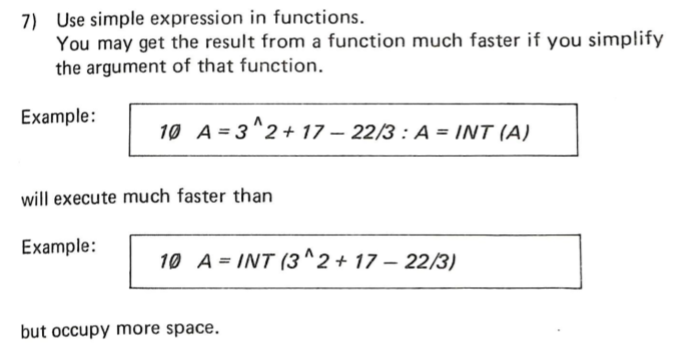
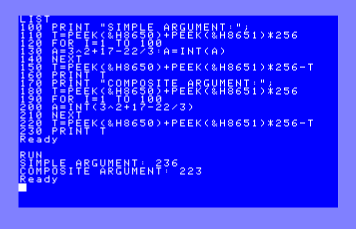

# GIOCANDO COL BASIC DEL LASER 500

Il Laser 500 dispone di un ottimo interprete BASIC; è siglato
"Video Technology BASIC 3.0" ma in realtà non è altro che 
un Microsoft BASIC (di ultima generazione peraltro), 
adattato alla macchina e concesso in licenza alla Video Technology. 

Cosa piuttosto singolare considerato il fatto che alla Video Technology 
avevano l'abitudine a clonare piuttosto che pagare diritti di licenze, 
però della cosa siamo sicuri in quanto alla fine del manuale si trova
un inusuale form di "non-disclosure agreement" con il quale l'utente
si dovrebbe impegnera a custodire il Microsoft BASIC e non farlo utilizzare
da persone non autorizzate, comunicando persino il luogo dove è custodito (!).

Di recente si è reso possibile approfondire i dettagli 
dell'implementazione dell'interprete BASIC del Laser 500 grazie al 
recupero del manuale della macchina di cui ne esistono 
solo pochissime copie in circolazione, una delle quali è stata gentilmente 
scansionata e condivisa dal retro-appassionato Carletto Provetto, a cui 
va la mia eterna riconoscenza. Il file è scaricabile direttamente
dal suo sito a [questo indirizzo](http://www.radioedintorni.it/Immagini/RetroComputer/RC-Manuali/Vtech-Laser-500.pdf).

A differenza di molti altri manuali dei computer dell'epoca 
(mi riferisco soprattutto ai Commodore) quello del Laser 500
è estremamente dettagliato, contiene tutte ma proprio tutte
le informazioni necessarie, dal BASIC all'hardware, compresi
gli schemi elettrici per eventuali riparazioni. Insomma
un manuale veramente ben fatto, come si faceva una volta!

All'epoca in Italia circolava quello in lingua francese piuttosto
che in inglese, e ricordo che la ditta che distribuiva il Laser in 
in Italia (la Scheidegger) commissionò una traduzione in italiano 
che però non fu portata mai a compimento. Mi capitò di
leggere le bozze della traduzione ed erano veramente ridicole poichè
i termini tecnici erano stati tradotti fuori dal contesto informatico; ad
esempio `bit` erano diventato `morso` (!). 

Ma torniamo al BASIC.

Sfogliando il suddetto manuale, a pagina 160 si trovano alcuni consigli 
su come rendere più efficienti i programmi BASIC. Fra questi ve n'è 
uno che mi ha insospettito:



Secondo quanto consigliato, rendere più semplice l'argomento di una funzione 
ne aumenterebbe la velocità di esecuzione. Ossia
```
A=3^2+17-22/3:A=INT(A)
```
sarebbe più veloce di
```
A=INT(3^2+17-22/3)
```

Ciò mi è sembrato piuttosto controintuitivo, così ho voluto 
mettere alla prova quanto affermato scrivendo un piccolo programma 
di test.

Dopotutto è sufficiente mettere le istruzioni incriminate a confronto
dentro un ciclo `FOR`, allo scopo di redere apprezzabile 
la differenza di tempo:

```
120 FOR I=1 TO 100
130 A=3^2+17-22/3:A=INT(A)
140 NEXT

190 FOR I=1 TO 100
200 A=INT(3^2+17-22/3)
210 NEXT
```

Adesso basterebbe semplicemente contare il tempo impiegato nei due `FOR`; vi
è però un problema: il BASIC del Laser 500 non dispone di un meccanismo
per misurare il trascorrere del tempo (l'equivalente 
della variabile `TI` o `TI$`), possiamo però ricorrere ad uno stratagemma.

Come si evince sempre dal manuale, nel Laser 500 il segnale 
`VSYNC` del chip video è collegato direttamente al pin `/INT` (interrupt) 
della CPU Z80. Questo fa si che ad ogni inizio del ritracciamento 
della pagina video, cioè esattamente ogni 20 millisecondi, 
venga generato un interrupt sulla CPU; questo poi è utilizzato dal kernel 
del Laser per eseguire alcune funzioni di base, come ad esempio la scansione della 
tastiera, il lampeggiamento del cursore, eccetera. 

Finita la routine di interrupt, il kernel da la possibilità all'utente di eseguire 
eventualmente una sua routine assembly. A tale scopo, completato l'interrupt, 
il kernel fa un jump in RAM alla locazione `$8012` nella quale normalemente 
vi è contenuta una istruzione `RET`. Modificando questa in `JP indirizzo` 
diventa possibile eseguire del proprio codice ad ogni ciclo di interrupt. 

L'idea è quella di scrivere una piccola subroutine che incrementi 
un contatore in memoria, il quale diverrà un sostituto della variabile `TI` non
presente nel BASIC del Laser.

In assembly Z80 sarà:

```
counter EQU $8650

timer:
   ld  hl, (counter)
   inc hl
   ld  (counter), hl
   ret
```

dove `$8650` è una word nella memoria bassa del Laser 500 normalmente non utilizzata. 
Il nostro contatore è dunque a 16 bit, questo ci consente di contare fino a circa 21 minuti prima
che raggiunga il massimo e riparta da zero (ossia 65536 x 20ms), un tempo più che sufficiente per
i nostri scopi.

Da BASIC potremo poi accedere al contatore semplicemente leggendolo con `PEEK`:
```
T=PEEK(&H8650)+PEEK(&H8651)*256
```

Oltre alla routine di interrupt vera e propria, ci serve anche il codice che installa
la stessa routine modificando il vettore del kernel a `$8012` appena descritto. Posiziamo il tutto 
all'indirizzo `$D000`, che è in una zona abbastanza alta nella RAM libera tale da non andare
in conflitto con il programma BASIC. 

```
org $d000

install:
   ld hl, 0            ; azzera il contatore
   ld (counter), hl    ;

   ld hl, timer        ; carica in HL l'indirizzo della routine "timer"

   di                  ; disabilita gli interrupt momentaneamente
   ld (0x8013), hl     ; scrive l'indirizzo della routine
   ld a, $c3           ; C3 è l'opcode per "JP"
   ld (0x8012), a      ; scrive "JP"
   ei                  ; riabilita gli interrupt
   ret
```

Dopo aver caricato la routine in RAM, possiamo eseguire la stessa
in vari modi, ad esempio dal monitor integrato in ROM (comando `MON`) 
con il comando:
```
D000G
```

Estendiamo ora il programma BASIC leggendo nelle locazioni 
del contatore che sfruttiamo a mo' di cronometro:

```
100 PRINT "SIMPLE ARGUMENT:";
110 T=PEEK(&H8650)+PEEK(&H8651)*256
120 FOR Z=1 TO 100
130 A=3^2+17-22/3:A=INT(A)
140 NEXT
150 PRINT PEEK(&H8650)+PEEK(&H8651)*256-T

170 PRINT "COMPOSITE ARGUMENT:";
180 T=PEEK(&H8650)+PEEK(&H8651)*256
190 FOR Z=1 TO 100
200 A=INT(3^2+17-22/3)
210 NEXT
220 PRINT PEEK(&H8650)+PEEK(&H8651)*256-T
```

Eseguendolo troviamo conferma ai
nostri sospetti: infatti la versione "consigliata" dal manuale
è leggermente più lenta, non più veloce! (236 ticks contro 223).
Vatti a fidare!



Non ho verificato, ma credo che questo risultato sia intuitivamente 
estendibile anche agli altri interpreti BASIC (Microsoft e non), 
lascio al lettore il compito di verificare sulla propria macchina vintage
preferita.

Trovate i sorgenti e gli eseguibili di questo piccolo esperimento
sul mio [repo su GitHub](https://github.com/nippur72/8-bit-projects/tree/master/laser500-simplify-argument)

